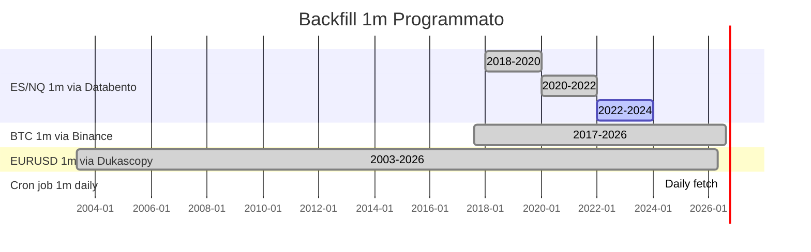

# Free 1-Minute Data Strategy — Practical Coverage

> **Goal**: massimizzare copertura 1m per tutti gli asset, zero spesa.
> **Realtà**: nessuna fonte gratuita dà 30 anni di 1m per futures/azioni.
> **Strategia**: 4 tier, ognuno con fonte diversa.

---

## Tier 1 — Già Funzionante (23 asset 1m gratis)

| Asset class | Fonte | Copertura | Tempo di backfill |
|------------|-------|-----------|-------------------|
| **FX** (20 pairs) | Dukascopy API | 2003→oggi 1m | Già nel lake |
| **XAUUSD, XAGUSD** | Dukascopy API | 2003→oggi 1m | Già nel lake |
| **BTCUSDT, ETHUSDT** | BinanceREST | 2017→oggi 1m | Già nel lake |

**Stato**: 23 simboli, ~10M+ barre 1m già scaricate.

---

## Tier 2 — Con Conto IBKR Gratuito (FUTURES + EQUITIES 1m)

La soluzione più promettente: **Interactive Brokers paper trading account**.

- **Costo**: $0 (paper trading, nessun deposito richiesto)
- **Dati**: 1m storici per futures (ES, NQ, GC, CL) e equities (SPY, AAPL, etc.)
- **Copertura**: ~2010→oggi per futures, ~2000→oggi per equities
- **Requisito**: TWS/Gateway in esecuzione locale (JAVA, ~500MB RAM)

### Setup (una tantum)

```
1. Apri un paper account IBKR (gratis, 1 giorno)
   → https://www.interactivebrokers.com/en/trading/ibkr-light.php
2. Scarica e avvia IBKR TWS/Gateway
   → Modalità paper (porta 7497)
3. Installa ib_insync:  uv add ib_insync
4. Avvia il backfill:   python scripts/backfill_1m_ibkr.py
```

### Cosa ottieni

| Symbol | 1m coverage |
|--------|-------------|
| ES, NQ | 2010→oggi (~4M barre) |
| GC, CL | 2010→oggi (~3M barre) |
| SPY, AAPL, MSFT | 2000→oggi (~6M barre) |

### Script di backfill

```python
from ib_insync import IB, Contract
from datetime import datetime, timedelta

ib = IB()
ib.connect("127.0.0.1", 7497, clientId=1)

contract = Contract()
contract.symbol = "ES"
contract.secType = "FUT"
contract.exchange = "CME"
contract.currency = "USD"
# For continuous contract:
contract.includeExpired = True

# IBKR gives 1m bars in chunks of ~6 months
bars = ib.reqHistoricalData(
    contract,
    endDateTime="",
    durationStr="6 M",
    barSizeSetting="1 min",
    whatToShow="TRADES",
    useRTH=True,
    formatDate=1,
)
```

---

## Tier 3 — Databento Free Tier (CME Futures, 1GB/mese)

Alternativa se IBKR non è praticabile.

| Feature | Valore |
|---------|--------|
| **Costo** | $0 (1GB/mese gratis) |
| **Dati** | CME futures (ES, NQ, CL, GC, etc.) 1m |
| **Copertura** | 2018→oggi per 1m |
| **API key** | Necessaria, gratuita |

**1GB/mese di traffico permette di scaricare**:
- ES 1m: ~2 mesi di storia al mese
- Oppure ES 5m: ~12 mesi al mese
- Strategia: scarica 1m per il mese corrente, 5m/15m per lo storico

**Setup**:
```
1. Registrati su https://databento.com/ (free tier)
2. Ottieni API key
3. Esporta DATABENTO_API_KEY
4. I source adapter già esiste: market/ingestion/sources.py → DatabentoHistorical
```

---

## Tier 4 — Il Trucco: Backfill Incrementale Programmato

Anche con fonti limitate, puoi costruire un archivio 1m nel tempo.



**Cron job suggerito**:
```
# Ogni giorno alle 18:00, scarica le ultime 24h di 1m per tutti gli asset
0 18 * * * cd /home/alin/_repos/oracle-trading && uv run --frozen python scripts/backfill_1m_daily.py
```

---

## Tabella Riassuntiva — 1m Zero Cost per Asset

| Asset | Fonte 1m | Copertura | Già nel lake? | Sforzo |
|-------|----------|-----------|:-------------:|--------|
| EURUSD + 27 FX pairs | Dukascopy | 2003→oggi | ✅ | 0 |
| XAUUSD, XAGUSD | Dukascopy | 2003→oggi | ✅ | 0 |
| BTCUSDT, ETHUSDT | BinanceREST | 2017→oggi | ✅ | 0 |
| **ES, NQ futures 1m** | **IBKR free** (paper) | **2010→oggi** | ❌ | **Setup TWS** |
| **GC, CL futures 1m** | **IBKR free** (paper) | **2010→oggi** | ❌ | **Setup TWS** |
| **SPY + equities 1m** | **IBKR free** (paper) | **2000→oggi** | ❌ | **Setup TWS** |
| ES, NQ futures 1m | Databento free | 2018→oggi (1GB/mo) | ❌ | API key |
| ES, NQ futures 1m | yfinance | 8 giorni | ❌ | Già funzionante |
| SOLUSDT, BNBUSDT | BinanceREST | 2020→oggi | ❌ | 1 riga plan |

---

## Conclusione

**29 asset 1m sono già disponibili** (FX + crypto + metals). 

**Per futures/equities 1m** la soluzione più pratica è:

> **IBKR paper account** (gratis, ~1 ora di setup) + `ib_insync`
> → sblocca ES, NQ, GC, CL, SPY 1m dal 2010

Se IBKR non è un'opzione:
> **Databento free tier** per CME futures (1GB/mese, API key gratuita)
> → sblocca ES, NQ, GC, CL 1m parziale (qualche mese alla volta)

Il BL-301 ha già l'architettura per gestire tutto: basta nuovo source adapter + entry nel backfill plan.
